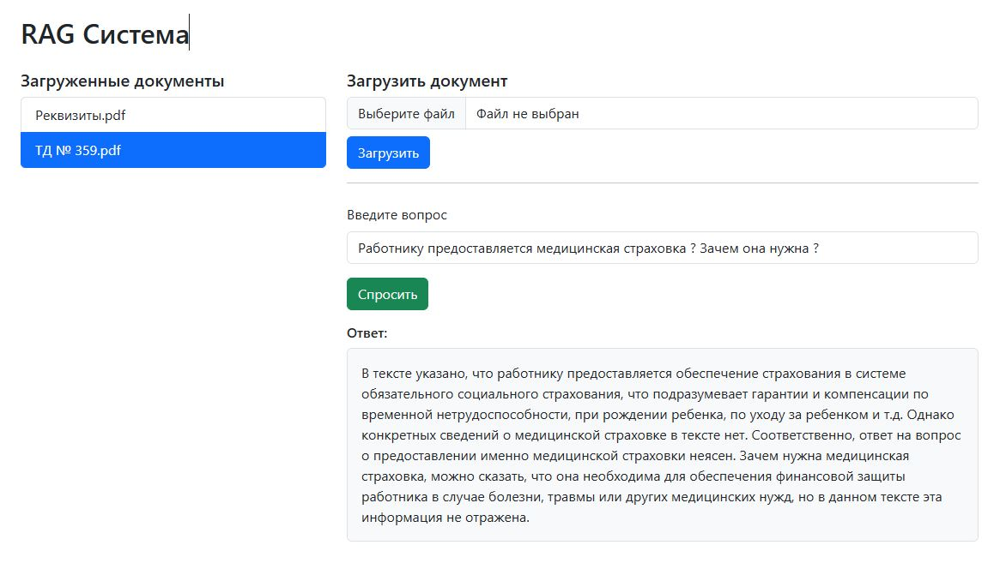

# Анализ документов с использованием RAG



## Описание

Проект реализует систему **Retrieval-Augmented Generation (RAG)** для поиска ошибок и несоответствий в загруженных документов и получения ответов на вопросы по ним на естественном языке.  
Целью является изучение и практическое применение RAG-архитектуры, а также построение простого веб-интерфейса на FastAPI для интерактивной работы с системой.

Система может быть использована как для **(PDF, DOCX, TXT и html)**

---

## Особенности

- Поддержка форматов: `.pdf`, `.docx`, `.txt`, `.html`.
- Индексация и хранение векторов с помощью [Chroma](https://www.trychroma.com/)
- Векторизация с использованием модели `text-embedding-3-small` от OpenAI
- Генерация ответов с помощью OpenAI GPT
- Поддержка многодокументного поиска
- Автоматический выбор источника при отсутствии явного указания

---

## Диаграмма взаимодействия ИИ-агентов

```mermaid
graph TD
    A[Пользователь] -->|Вопрос + (опц. источник)| B(Контроллер /ask)
    B -->|source задан| C[Агент RAG (retrieval + generation)]
    B -->|source не задан| D[Агент выбора источника]
    D --> C
    C --> E[Реранкер (опционально)]
    E --> F[LLM (ответ)]
    C --> F
    F --> A
```
---

## Быстрый старт
- pip install -r requirements.txt
- OPENAI_API_KEY=your_openai_key
- запустить в консоли fastapi dev main.py     